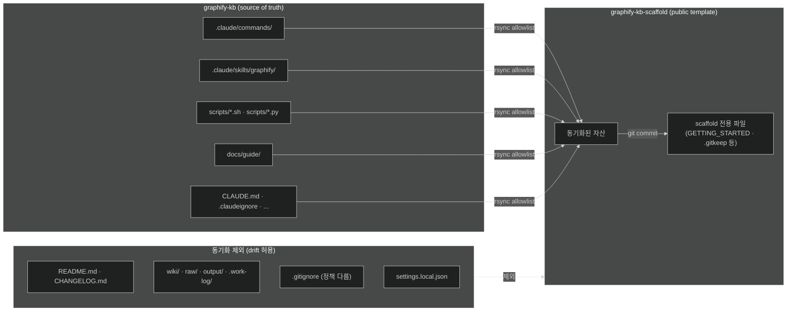
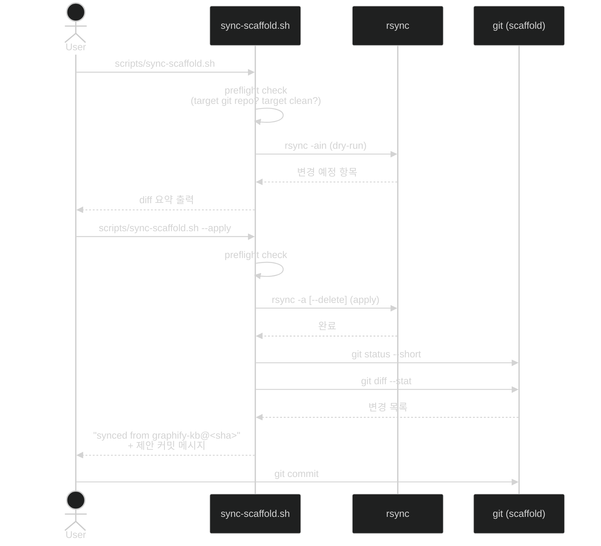

# Scaffold 동기화 가이드

`graphify-kb-scaffold`는 이 저장소(`graphify-kb`)의 공개 템플릿 시드입니다.  
개발·검증은 `graphify-kb`에서 진행하고, 준비된 자산을 `sync-scaffold.sh`로 scaffold에 단방향 재전파합니다.

---

## 아키텍처



---

## 빠른 시작

> ⚠️ **아래 명령은 graphify-kb 안에서만 실행한다.** scaffold 로 만든 저장소에도 `sync-scaffold.sh` 가 복사돼 있지만, 거기서 인자 없이 실행하면 기본 타겟 `../graphify-kb-scaffold` 로 **그 저장소 내용이 공개 scaffold 에 동기화된다.** 다른 하류 저장소로 보낼 때도 graphify-kb 에서 `--target <경로>` 를 붙여 실행한다.

```bash
# ⚠️ graphify-kb 안에서만 실행 — scaffold 로 만든 저장소에서 실행 금지 (위 경고 참조)
# 1. dry-run — 변경될 파일 미리 보기 (실제 변경 없음)
scripts/sync-scaffold.sh

# 2. 변경 내용 확인 후 적용
scripts/sync-scaffold.sh --apply

# 3. scaffold 저장소로 이동해 변경 검토
cd ../graphify-kb-scaffold
git status
git diff --stat

# 4. 커밋 (제안 메시지는 스크립트 출력 마지막 줄에 표시)
git add -p
git commit -m "chore: sync templates from graphify-kb@<sha>"
```

### scaffold 경로 오버라이드

```bash
# 환경 변수
SCAFFOLD_DIR=~/projects/my-kb scripts/sync-scaffold.sh --apply

# 플래그
scripts/sync-scaffold.sh --apply --target ~/projects/my-kb
```

---

## 프로세스 다이어그램



---

## 동기화 대상 / 제외 파일

### 대상 (allowlist)

| 항목 | 방식 | 설명 |
|------|------|------|
| `.claude/commands/` | dir (--delete) | 슬래시 커맨드 명세 전체 |
| `.claude/rules/` | dir (--delete) | scaling 등 LLM 운영 규칙 |
| `.claude/skills/graphify/` | dir (--delete) | graphify 스킬 오버라이드 |
| `docs/guide/` | dir (--delete) | commands / graphify / troubleshooting / scaffold-sync / ai-memory-stack / wiki-schema |
| `raw/_templates/` | dir (--delete) | ingest 템플릿 |
| `.claude/settings.json` | file | 프로젝트 Claude Code 설정 |
| `.githooks/pre-commit` | file | pre-commit 훅 |
| `.claudeignore` / `.graphifyignore` | file | 스캔 제외 패턴 |
| `CLAUDE.md` | file | LLM 행동 지침 |
| `docs/architecture.md` / `docs/tutorial.md` / `docs/obsidian-setup.md` | file | 공유 문서 |
| `scripts/*.sh` (13개, self-sync 포함) | file | 운영 스크립트 |
| `scripts/*.py` (19개) | file | lint·backlinks·graph 재빌드 등 위 자산이 호출하는 파이썬 스크립트 |

전파 대상은 **`scripts/` 36개 중 32개**다. 개별 `file:` 항목으로 등재하며 `dir:scripts` 로 뭉치지 않는다 — `--delete` 가 scaffold 전용 `regen-graphify-skill.sh` 를 지운다.

전파되지 않는 4개:

| 파일 | 이유 |
|------|------|
| `check-mirrors.py` | scaffold 에 `.agents/`·`.codex/` 가 없어 「선언된 미러 루트 부재」 로 무조건 실패한다 (2026-08-19). 전파하려면 「미러 자산 0건이면 통과」 분기가 필요하며 별건이다. preflight 의 `EXEMPT_REFS` 에 등재돼 있다 |
| `check-raw-structure.py` / `compare-raw-source.py` / `test_check_extraction_chunks.py` | 어떤 전파 자산도 호출하지 않는다 (포함 기준 미달) |

### 제외 (denylist)

| 항목 | 이유 |
|------|------|
| `README.md` | clone URL / 브랜딩이 다름 |
| `docs/CHANGELOG.md` / `PLAN.md` / `log.md` | 저장소별 독립 이력 |
| `docs/GETTING_STARTED.md` | scaffold 전용 온보딩 |
| `docs/improvement-plan.md` / `docs/plan/` | main 전용 내부 자료 |
| `.gitignore` | 정책 다름 (main: 구체 경로 / scaffold: `graphify-out/*` 와일드카드) |
| `.claude/settings.local.json` | 토큰·로컬 경로 포함 가능, 절대 동기화 금지 |
| `.claude/settings.local.json.example` | scaffold 수동 관리 |
| `wiki/` / `raw/` (`_templates` 제외) / `output/` / `.work-log/` / `graphify-out/` | 사용자 KB 데이터 |
| `.git/` / `.DS_Store` / `.obsidian/` / `.claude/worktrees/` | 런타임·시스템 파일 |

---

## 주의사항

### 1. `.gitignore` 는 수동 관리

두 저장소의 `.gitignore` 정책이 다릅니다.

| 저장소 | 패턴 |
|--------|------|
| `graphify-kb` | `graphify-out/.graphify_python`, `graphify-out/cache/` 등 구체 경로 열거 |
| `graphify-kb-scaffold` | `graphify-out/*` 와일드카드 + `!graphify-out/.gitkeep` 예외 |

scaffold의 `.gitignore`는 절대 덮어쓰지 않습니다. 변경이 필요하면 scaffold에서 직접 편집 후 커밋하세요.

### 2. `settings.local.json` 보안

`settings.local.json`에는 API 키, 로컬 경로, 개인 정보가 포함될 수 있습니다.  
이 파일은 동기화 대상에서 명시적으로 제외되어 있으며, scaffold의 `.example`은 수동으로 관리합니다.

### 3. `--delete` 동작 이해

`dir` 타입 항목(`.claude/commands/` 등)은 `rsync --delete`로 미러링됩니다.  
**main에서 파일을 삭제하면 scaffold에서도 삭제됩니다.**  
파일 이름 변경·이동 시 반드시 dry-run으로 먼저 확인하세요.

```bash
# rename 전 dry-run 확인
scripts/sync-scaffold.sh   # 삭제/추가 항목 미리 보기
```

### 4. self-sync 순서

`sync-scaffold.sh` 자체도 allowlist에 포함됩니다(self-sync).  
버그 픽스 후 반드시 **main 커밋 → sync** 순서를 지키세요.  
sync 중에 스크립트가 교체되어도 bash 프로세스는 이미 메모리에 로드된 상태로 계속 실행되므로 안전합니다.

### 5. target dirty 상태

`--apply` 실행 전 target이 dirty 상태이면 기본으로 abort됩니다 (exit 2).  
이는 미커밋 WIP를 덮어쓰는 사고를 방지하기 위한 안전장치입니다.

```bash
# scaffold에서 정리 후 재실행
cd ../graphify-kb-scaffold && git stash && cd -
scripts/sync-scaffold.sh --apply

# 또는 강제 진행 (위험 — 변경 손실 주의)
scripts/sync-scaffold.sh --apply --force
```

### 6. 참조 무결성 preflight (exit 5)

rsync 직전, 전파 대상 자산 전체에서 `scripts/<name>.(py|sh)` 참조를 긁어 **전부 allowlist 에도 있는지** 검사합니다. 없으면 dry-run·apply 양쪽에서 **exit 5 로 죽습니다.**

```
[err]  scripts/wiki_scan.py
[err]  위 스크립트를 전파 자산이 부르는데 allowlist 에 없습니다.
```

전파 대상에는 스크립트 자신도 들어 있으므로 이 검사는 **전이 참조까지 스스로 닫습니다** — 예컨대 `graphify-build.sh` 가 부르는 `cleanup-meta-caches.py`·`rebuild-graph-report.py` 는 전파 자산을 1차로 훑을 때는 안 보이고, `graphify-build.sh` 가 allowlist 에 들어온 뒤에야 잡힙니다.

**왜 있는가**: 2026-08-24 에 전파 자산이 부르는 스크립트 25종이 scaffold 에 없다는 것이 발견됐습니다. scaffold 사용자가 `/lint`·`/compile`·`/ingest` 를 부르거나 `AGENTS.md` 지시대로 `graphify-build.sh` 를 돌리면 없는 파일을 부르는 상태였습니다. `.claude/settings.json` 의 훅들은 `[ -f ... ]` 가드가 있어 조용히 건너뛰었으므로 **증상이 드러나지 않았습니다** — 그래서 사람 눈이 아니라 실행되는 검사로 못박았습니다.

**해제 방법은 두 가지뿐입니다**: SYNC_ITEMS 에 추가하거나, 전파하지 않을 사유를 문서에 적고 `EXEMPT_REFS` 에 넣거나. 검사를 끄는 플래그는 없습니다.

---

## 트러블슈팅

| 증상 | 원인 | 해결 |
|------|------|------|
| `target working tree is dirty` (exit 2) | scaffold에 미커밋 변경 | `git stash` 또는 커밋 후 재실행, 또는 `--force` |
| `target path is not a git repo` (exit 3) | 경로 오타 또는 clone 누락 | `SCAFFOLD_DIR` 확인, `git clone` 재시도 |
| `... allowlist 에 없습니다` (exit 5) | 전파 자산이 부르는 스크립트가 SYNC_ITEMS 에 없음 | 해당 스크립트를 SYNC_ITEMS 에 추가, 또는 사유를 문서화하고 `EXEMPT_REFS` 에 등재 (주의사항 §6) |
| `source not found (skipping): <path>` | allowlist 경로가 main에 없음 | main에서 해당 파일 경로 확인 후 SYNC_ITEMS 수정 |
| 두 저장소 drift 의심 | 오랫동안 sync 미실행 | `diff -rq --exclude='.git' <src> <tgt>` 로 수동 감사 |
| dry-run에서 과다 삭제 표시 | `--delete` 항목의 scaffold 전용 파일 | denylist 점검 또는 해당 항목을 `file` 타입으로 분리 |
